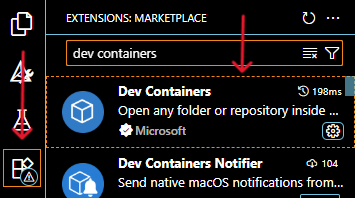

# conan-tourmalinecore-recipes

Repository for conan recipes used in the Tourmaline Core organization.

## Local testing

### Windows

System requirements:
- Installed Python with pip latest version https://www.python.org/downloads/
- Installed conan `pip install conan`
- Installed Build Tools for Visual Studio with Desktop development with C++ https://visualstudio.microsoft.com/downloads/?q=build+tools#build-tools-for-visual-studio-2026

1. Run the `Developer Command Prompt for VS` from the *Start bar* with Administrator rights. 
2. Move workspace of terminal into `conan-tourmalinecore-recipes` repository folder.
3. Run `conan profile detect` and then `conan create recipes/libodb/all --version=2.5.0 -b missing`.

### Dev Container - Linux

System requirements:

- Install [WSL](https://ubuntu.com/desktop/wsl) 
- Install the Docker client ([Windows](https://docs.docker.com/desktop/setup/install/windows-install/) / [Mac](https://docs.docker.com/desktop/setup/install/mac-install/) / [Linux](https://docs.docker.com/desktop/setup/install/linux-install/)) 
  - Make sure Docker client is the latest version
    

      
Screenshot

      
    

  - Make sure Docker uses WSL 2 based engine
    

      
Screenshot

      
    

- Microsoft VSCode
  - VSCode should also have the [Dev Containers](https://code.visualstudio.com/docs/devcontainers/containers) extension installed. To check it, open "View: Extensions" with `Ctrl + Shift + X` or as shown in the screenshot below:
    

      
Screenshot

      
    

- Before running the container, create a `.env` file in the project root and specify the environment variables in it, just as you did in `.env.example`. Otherwise, running the devcontainer will result in an error.
- Make sure Docker daemon is running before opening the devcontainer (`Ctrl + Shift + P` -> "Reopen in container" or click here + "Reopen in container")
  

    
Screenshot

    
  

Run `conan profile detect` and then `conan create recipes/libodb/all --version=2.5.0 -b missing`.

## Known issues

#### Stuck in `libname/X.Y.Z: Calling source() in C:\Users\user\.conan2\p\libname************\s\src`.
Please use another network with access to sources. Requested url you might find in `recipes\libname\all\conandata.yml` file.
